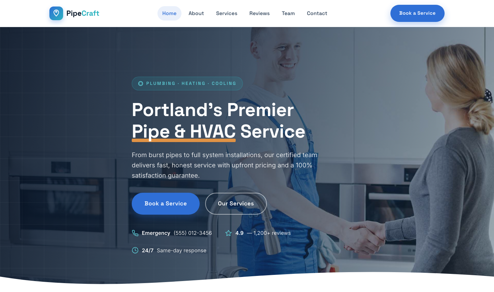

# PipeCraft — Plumbing, Heating &amp; Cooling

A premium, framework-free HTML template for a local trade-services business. A deep water-navy ground with steel-blue, aqua, and copper accents — driven by Space Grotesk display type and Inter body text — a confident, trustworthy home for a plumbing, heating, and cooling company with 24/7 emergency dispatch.

## 📸 Screenshot

## Design System

| Token | Value |
|-------|-------|
| **Ground** | `--ink-900` `#0c1a2b` (deep navy), `--paper` `#f3f7fb` (light) |
| **Primary** | `--blue-500` `#2f6fd6` (steel blue), `--aqua-500` `#2bb3c0` (water accent) |
| **Secondary** | `--copper-500` `#c8772e` (pipe accent), `--aqua-400` `#5cc8d2` |
| **Text** | `--text` `#33465c`, `--text-strong` `#0e2036`, `--muted` `#6b7d93` |
| **Display type** | `Space Grotesk` (sans, 500–800) |
| **Body type** | `Inter` (sans, 400–700) |
| **Container** | 1200px max-width, centered |
| **Breakpoints** | ~1100px (grid collapse), ~900px (mobile nav), ~640px (mobile) |

## Pages

| Page | File | Description |
|------|------|-------------|
| Home | [index.html](index.html) | Hero with crossfade, stats, about, services, emergency band, team, reviews |
| About | [about.html](about.html) | Company story, stats, core values |
| Services | [service.html](service.html) | Full service grid, process steps, emergency band |
| Reviews | [testimonial.html](testimonial.html) | Customer testimonials and brand strip |
| Team | [team.html](team.html) | Technician grid and careers section |
| Booking | [booking.html](booking.html) | Appointment form with `[data-form]` validation and what-happens-next summary |
| Contact | [contact.html](contact.html) | Contact form with `[data-form]` validation, info cards, hours |
| 404 | [404.html](404.html) | On-brand error page with recovery links |

## Features

- **Framework-free** — pure HTML5, CSS3 (custom properties, Grid, Flexbox, `clamp()`), vanilla JavaScript
- **Trade-service aesthetic** — deep navy grounds, steel-blue and water-aqua accents, copper highlights
- **Fluid responsive** — three breakpoints, no horizontal scroll on any viewport
- **Scroll reveal** — IntersectionObserver-powered `.reveal` animations (respects `prefers-reduced-motion`)
- **Mobile nav** — burger toggle with `aria-expanded` accessible pattern
- **Hero crossfade** — automatic 6s image transition via `.hero-bg img` + `.active` class
- **Emergency pulse** — animated copper `pulse-ring` call-to-action band
- **Form validation** — `[data-form]` hook with `.form-ok` / `.form-err` / `.show` toggle
- **Original imagery** — production-quality plumbing and technician photography, no placeholders

## Tech Stack

- HTML5 + CSS3 (W3C-valid, semantic landmarks)
- Vanilla JavaScript (canonical IIFE build)
- Google Fonts (Space Grotesk + Inter)
- SVG favicon (inline data: URI)

## SEO

- Semantic HTML5 structure (`<header>`, `<nav>`, `<main>`, `<section>`, `<footer>`)
- Unique `<title>` and `<meta description>` per page
- `lang="en"` attribute, `charset="utf-8"`, viewport meta
- Alt text on all images

## License

Free for personal and commercial use. Attribution appreciated but not required.

---

## Let's Build Something Together 🚀

[Book a free consultation](https://tally.so/r/q4q1L9)
